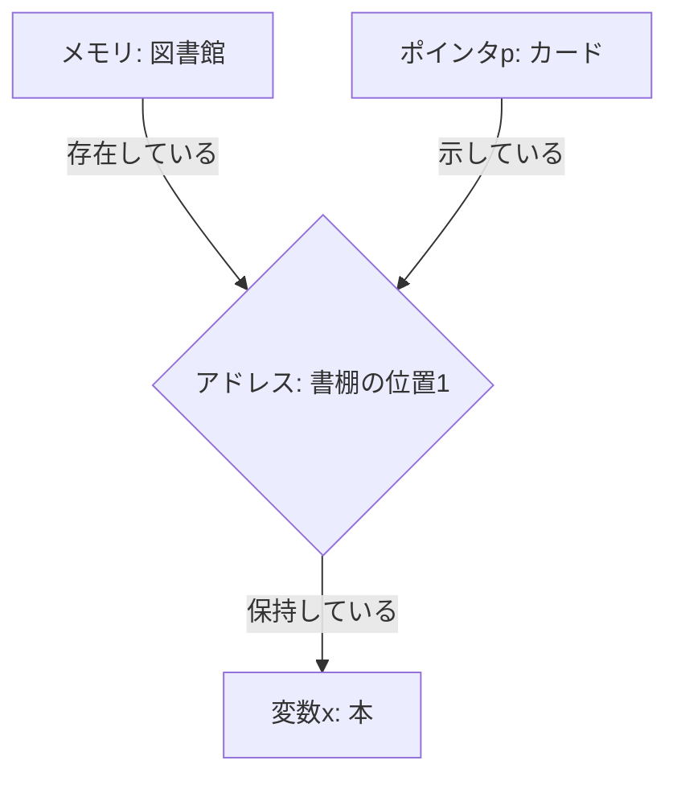
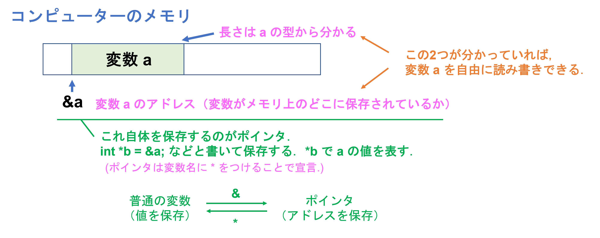
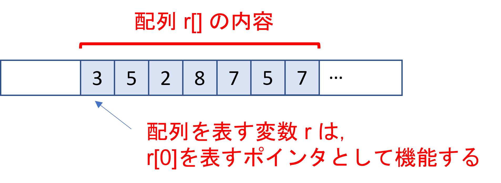

## ポインタ

C言語のポインタは、変数のメモリ上の位置、つまりアドレスを保持する変数である。それぞれの変数は一意のアドレスを持ち、それはメモリ上の変数の位置を示す。ポインタはこのアドレスを指している。それがポインタの名前の由来である。



この図では、メモリ（図書館）にはアドレス（書棚の位置）が存在し、それぞれのアドレスには変数（本）が保存されている。そして、各ポインタ（カード）はそれぞれの変数のアドレス（書棚の位置）を指している。この概念を理解することで、C言語におけるメモリ管理とポインタの役割が明らかになる。

ポインタの宣言と初期化は以下のように行います。例えば、`int`型の変数を指し示すポインタは"int _"と宣言します。変数名の前にアスタリスク(_)をつけて宣言します。

```c
int *ptr;  // int型のポインタ変数ptrの宣言
int num = 5;  // int型の変数numの宣言と初期化
ptr = &num;  // ポインタptrに変数numのアドレスを代入
```

上記の例では、`&`演算子を使用して、変数`num`のアドレスをポインタ`ptr`に代入しています。次に、ポインタが指し示すメモリ上の値にアクセスするために、`*`演算子を使用します。

```c
int value = *ptr;  // ポインタptrが指し示す値を変数valueに代入
```

他の型のポインタも同様に宣言します。例えば、`double`型のポインタは次のように宣言します：

```c
double *b;
```

ポインタが指し示す変数を使用する際にも`*`を使います。ただし、これはポインタ変数の宣言時の`*`とは異なる意味で使われます。

```c
int *a;
*a = 2;
printf("%d \n", *a);
```

  実行結果

  ```
  2
  ```

※ 最初は，あまり「アドレス」は意識しなくて良い．関数に渡すときに，コピーではなく，変数の実体を渡している，というような感じ．

※ 「アドレス」を意識した応用は，また，別の機会に学習．

**サンプルコード**：
例1）基本文法の練習
```c
//pointer1.c
#include<stdio.h>

int main() {
   int x = 10; // xという名前の整数型変数を作成、10を代入する
   int *p; // ポインタ変数pを作成

   p = &x; // xのアドレスをpに代入
   
   printf("%d\n", *p); // ポインタpが指している値（xの値）を出力
   return 0;
}
```

このコードでは、`int`型の変数`x`を定義し、その後`int`型のポインタ`p`を定義する。そして、`x`のアドレスを`p`に代入する。これにより、`p`は`x`を指し、`x`を間接的に操作できる。

例2）いろいろな書き方の例．

```c
//pointer2.c
#include <stdio.h>

int main(void){
        int a=1;
        int *b; //int 型の変数のアドレスを保存できる変数 b を作る．
        int c=2, *d=&c; //混ぜて変数を宣言することも出来る．
        b = &a; //ポインタ b は a を表すことにする．
        printf("%d \n", *b); // b の表す変数である a の値（1）が表示される．
        printf("%d \n", *d); // d の表す変数である c の値（2）が表示される．
    	*d = 3; // d の表す変数である c の値を 3 に更新する．
        printf("%d \n", c); // c は3になっているので 3 と表示される．
        return 0;
}
```

実行結果

```bash
1
2
3
```


## 

例3）ポインタ変数を使って、2つの整数値を交換する関数`swap`を作成せよ。

```c
//pointer4.c
#include <stdio.h>

void swap(int *a, int *b) {
    int temp = *a;
    *a = *b;
    *b = temp;
}

int main() {
    int x = 5, y = 10;

    printf("交換前： x = %d, y = %d\n", x, y);
    
    swap(&x, &y);  // 変数のアドレスを関数に渡す
    
    printf("交換後： x = %d, y = %d\n", x, y);
    
    return 0;
}
```

このコードでは、関数`swap`は二つの`int`型のポインタを引数として受け取る。それぞれのポインタは、交換したい二つの整数変数のアドレスを指している。関数内部で、ポインタを通じて直接これらの変数の値を変更し、それらの値を交換している。それにより、関数呼び出し元の`x`と`y`の値が交換される。

注意点として、関数を呼び出す際には、引数として変数のアドレス（`&x`および`&y`）を渡す必要がある。これにより、関数内部で変数の実際の値を変更することができる。これがポインタを使用する主な目的の一つであり、C言語の重要な概念である。

_**Q&A**_

**質問1：** `temp`はポインタであるか？

**回答：** いいえ、`temp`はポインタではない。`temp`は通常の整数型（`int`）の変数で、一時的に値を保存するために使用される。この場合、`*a`の値（`a`が指す値）を一時的に保存している。

* * *

**質問2：** `int temp = *a; *a = *b; *b = temp;` このコードはアドレスを渡しているのか、それとも値を渡しているのか？

**回答：** このコードでは、値が渡されている。具体的には、`*a`と`*b`は、ポインタ`a`と`b`が指す値を参照する。つまり、アドレスではなく、そのアドレスに格納されている値を直接操作している。

* * *

**質問3：** ポインタ`p`に値を割り当てるときに`p = &v`と書くと、`p`は変数`v`のアドレスを指す。では、なぜ`swap`関数を呼び出すときには`&x`と`&y`を引数として渡すのか？ `swap`関数の定義は`swap(int *a, int *b)`だが、これは`*a = &x`を意味するのか？

**回答：** `swap(int *a, int *b)`関数は`int`型のポインタを引数として受け取る。したがって、この関数を呼び出すときには、アドレスを引数として渡す必要がある。つまり、`&x`と`&y`を引数として渡す。`&x`は変数`x`のアドレスを表し、`&y`は変数`y`のアドレスを表す。これらのアドレスは関数に渡され、`a`と`b`がこれらのアドレスを指すようになる。よって、`*a = &x`ではなく、`a = &x`が正しい。

* * *
**質問4(関数の復習)：** ポインタを使用しないで`swap`関数を作成することは可能ですか？ その場合、その動作はどのようになるか？

**回答：** C言語では、ポインタを使用しないと、関数内部で直接変数の値を交換することはできない。これは、C言語がデフォルトで値渡しを行い、関数内部での変更が呼び出し元の変数に影響を与えないためである。仮に，以下のようなswap_without_pointer関数を作成したとする：

```c
#include <stdio.h>

void swap_without_pointer(int a, int b) {
    int temp = a;
    a = b;
    b = temp;
}

int main() {
    int x = 5, y = 10;

    printf("交換前： x = %d, y = %d\n", x, y);
    
    swap_without_pointer(x, y);  // 変数の値を関数に渡す
    
    printf("交換後： x = %d, y = %d\n", x, y);  // 値は交換されていない
    
    return 0;
}
```

このコードを実行すると、"交換後"の`x`と`y`の値は交換されていないことがわかります。これは、`swap_without_pointer`関数が値をコピーして使用しているため、関数内部での値の変更が`x`と`y`に反映されないからです。これに対し、先ほどの`swap`関数では、ポインタを使用して`x`と`y`の実際の値を直接変更しています。この差異は、C言語における値渡しとポインタの使用の違いを明確に示しています。


例4）受け取った変数を，その変数の3乗に置き換える関数．

```c
//pointer3.c
void cube(int* a){// main 関数の中の変数 a そのものをポインタとしてもらう．
    int b = *a; // a の値を使うときには *a のように書く．
    *a = b*b*b; // *a**a**a; と書いても良い（が読みにくい）．
    return;
}

int main(void){
    int a=2;
    cube(&a); // 変数 a そのものを変更できるようにメモリ上のアドレスを渡す．
    printf("%d\n", a); // 8が表示される．
    return 0;
}
```


## 配列を引数とする関数


配列はベクトルのようなものであったので，例えば，

- ２つのベクトルを引数として内積を計算する関数
- ベクトルを乱数で初期化する関数

など，ベクトルを操作する関数を作りたいときには，配列を引数とする関数を作ればよい．

プログラム例）

```c
//array4.c
#include <stdio.h>
#include <stdlib.h>

int inner_prod(int u[], int v[], int n){ //配列は実質的にポインタとして渡される．配列のサイズも教えておく．
        int i, ip;
        ip = 0;
        for(i=0;i<n;i++){
                ip = ip + u[i]*v[i];
        }
        u[0]=u[0]+1; //内積を計算した後，１つ目のベクトルを少し書き換えてみる．
        return ip;
}

void rand_vec(int *r, int n){ //このように，ポインタとして扱ってもよい．
        int i;
        for(i=0;i<n;i++){
                r[i]=rand()%10;
        }
}

int main(void){
        int r[3], s[3];
        rand_vec(r, 3); //rを乱数で初期化
        rand_vec(s, 3); //sを乱数で初期化
        printf("r: %d %d %d\n", r[0],r[1],r[2]);
        printf("s: %d %d %d\n", s[0],s[1],s[2]);

        printf("%d\n", inner_prod(r,s,3));

        printf("r: %d %d %d\n", r[0],r[1],r[2]); //書き換えられたので，最初の表示と少し変わる．
        printf("s: %d %d %d\n", s[0],s[1],s[2]);

        return 0;
}
```

注意）

- 配列を表す変数（例えば int var[10];）の**変数名（var）は，その配列の先頭の変数（var[0]）を表すポインタ**になる．

- 関数で引数として渡すときは，**コピーではなく，配列そのもの**が渡される．

- 関数を作る際，引数に配列を指定するときには

  ```c
  変数の型 変数名[]
  ```

  のように書く．これだけだと**配列の大きさが分からないので，それも引数に入れておく**．

- 引数の指定では，ポインタを受け取るようにしてもよい．

- 関数を使うときには，配列の変数名をそのまま書けばよい．

- 普通の変数と同じように　変数 = 変数　としてコピーすることはできない．

  

上のプログラムの実行例）２回目に表示された r の値が書き換わっているのに注意．

```bash
r: 3 6 7
s: 5 3 5
68
r: 4 6 7
s: 5 3 5
```

参考）配列を引数とする関数で，うっかり，引数として受け取った変数を書き換えてしまうのを防ぎたい場合には const をつけておく．下のプログラムは，エラーになり，コンパイルできない．

```c
//array4-2.c
int inner_prod(const int u[], int v[], int n){ //配列は実質的にポインタとして渡される．配列のサイズも教えておく．
        int i, ip;
        ip = 0;
        for(i=0;i<n;i++){
                ip = ip + u[i]*v[i];
        }
        u[0]=u[0]+1; //内積を計算した後，１つ目のベクトルをうこし書き換えてみる．
        return ip;
}
```

## 

**宿題1：**
関数 update を実行したら，$x, y, z$ の値が更新されるように，下の書きかけのプログラムを完成させよ．

```c
#include <stdio.h>

int main(void){
  double x, y, z, nx, ny, nz, a, b;
  x = 99;
  y = 1;
  z = 0;
  a = 0.01;
  b = 0.01;

  void update(   ){
      // x, y, z を更新する式を書く．
      return;
  }
    
  for(i=0;i<30;i++){// for や while を使って，下の部分を繰り返す．

    // 次の日になるので「今日の値」を「明日の値」に書き換える．
    update( );
  }
  
  printf("感染したことがない人は %lf 人\n", x);
  printf("感染している人は %lf 人\n", y);
  printf("回復した人は %lf 人\n", z);
  return 0;
}
```

**注意**

- 引数などは自由に決めてよい．例えば，update の中では1日分の更新のみを行っても良いし，更新する日数を引数として設定し，まとめて複数日分を更新してもよい．

- update の引数としては，変数 $x, y, z$ に関係するもの以外に，パラメータ $a, b$ なども必要となることに注意（$a, b$ の有効範囲は main 関数の中．update 関数の中では有効ではない．）


**宿題2：**

一組の学生の成績が配列に保存されています。あなたのタスクは以下の機能を持つプログラムを作成することである：

1. 全生徒の成績の合計を計算する関数。
2. 全生徒の成績の平均を計算する関数。

プログラムは以下の要件を満たす必要がある：

  - 成績データは配列として与えられる。
  - 関数は配列とそのサイズを引数として取る。
***
```c
//homework_q2.c
#include <stdio.h>

//全生徒の成績の合計を計算する関数
int calc_total_score(int scores[], int n){
    int i;
    int total = 0;
    //ここにコードを追加して、成績の合計を計算します。
    return total;
}

//全生徒の成績の平均を計算する関数
double calc_avg_score(int scores[], int n){
    //ここにコードを追加して、成績の平均を計算します。
}

int main(void){
    int scores[] = {80, 85, 78, 90, 88, 76, 93, 87, 74, 91};
    int n = sizeof(scores) / sizeof(scores[0]);

    printf("Total Score: %d\n", calc_total_score(scores, n));
	//ここにコードを追加して、成績の平均を出力します。
    //ここにコードを追加して、成績の平均を出力します。

    return 0;
}
```

この問題では、配列を引数として受け取る2つの関数を完成させることが求められている：`calc_total_score`は全生徒の成績の合計を計算し、`calc_avg_score`は全生徒の成績の平均を計算する。また、`main`関数内でこれらの関数の結果を出力するコードも追加する必要がある。
