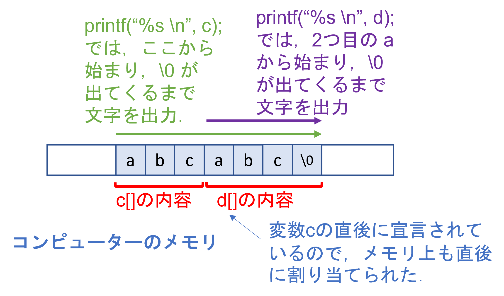

## 文字列

- これまで，整数や浮動小数点を入れておく変数は出てきていたが，文字列を入れておく変数は出てきていなかった．
- 文字列は，C言語では「文字が並んだもの」と考えて「文字を表す型の配列」として扱う．
- ただし，文字列の最後には \0 という特別なデータが入る（改行を \n で表したのと同じように，文字列の最後を \0 で表す．）これが無いと，プログラムは文字列の最後を見つけられないので注意．

### アルファベットや数字など，半角文字列の扱い方

**文法**

- **文字**を表す変数は char 型．

- char型の変数は**半角文字**を保存できる．

- 実際には，各半角文字には，数字が割り当てられている．
  char 変数は -128 から 127 までの数字が保存できるようになっており，その数字に対応する文字を保存している，と解釈する．

  文字と数字の対応例（ASCIIコード）

  | 文字 | 対応する数字 | 文字 | 対応する数字 | 文字 | 対応する数字 |
  | ---- | ------------ | ---- | ------------ | ---- | ------------ |
  | A    | 65           | a    | 97           | (    | 40           |
  | B    | 66           | b    | 98           | +    | 43           |
  | C    | 67           | c    | 99           | \0   | 0            |

- 文字列は char 型の配列として定義する．最後に \0 が入るので，配列の大きさは　文字数＋1　となる．

- printf で出力するときなどは %s を使う．

- 数字の範囲が決まっているため，**ひらがな，カタカナ，漢字などの全角文字を表すときには，1文字につき，char 型変数を複数使う．**

  - 全角文字とchar型変数の対応付けには，いくつかの方式がある（文字コードと呼ぶ）．例えば，Windows と Mac では違う方式が使われる（ことがある）．
  - 1文字あたり，いくつの char 変数が必要かは，方式によって大きく異なる．そのため，全角文字を扱う場合には，注意が必要になる（**全角文字は使わないほうがプログラムは簡単**になる．）

例）

```c
// char1.c
#include <stdio.h>

int main(void){
        char c = 'a'; //c という文字を保存する変数に a という文字を入れた．
        char d[4] = "abc"; // d という文字の配列に abc という文字列を入れた．
        char e[] = "abcdef"; // 大きさを指定しなければ，自動的に調整してくれる．

        printf("%s %s \n", d, e); //
}
```

例2）c のほうには \0 を入れていない．そのため，実行結果がおかしくなる．

```c
// char2.c
#include <stdio.h>

int main(void){
        char c[3] = {'a','b','c'}; // c という文字の配列に abc という文字列を入れた．ただし，文字列の最後 \0 を入れていない．
        char d[4] = {'d','e','f','\0'}; // d という文字の配列に abc と文字列の最後 \0 を入れた．

        printf("%s\n", c);
        printf("%s\n", d);
}
```

実行結果例（環境に依存して実行結果が変わる可能性があります）

```bash
abcdef
def
```

※ printf は，メモリ上の文字を順番に見ていき，\0 が出てくるまで出力する．上の例だと，メモリ上に c と d の内容が並んで割り当てられているため，c の内容を出力した後，dの内容が出力されたと考えられる．



### 全角文字列の扱い方

- 全角文字も同じように扱うことは出来る．
- Mac などで使われることが多い UTF-8 という文字コード（文字と数字の対応方式）では，1文字あたり3つの char 変数が使われることが多い（珍しい漢字などには 4 つ以上の変数が使われる．）

例）sizeof という演算子を使って，文字列にいくつの char 変数が使われているかを確認してみる．

【sizeof】

- 引数である変数に何バイトのメモリが割り当てられているかを調べる演算子．
- char 変数1つは1バイトなので，char変数いくつ分かが分かる．
- long int 型の数字が返ってくるので，printf では %lf を使う．

```c
// char3.c
#include <stdio.h>

int main(void){
        char c[] = "あいうえお"; 
        char d[] = "寿限無寿限無五劫の摺り切れ"; 

        printf("%s %ld\n", c, sizeof(c));
        printf("%s %ld\n", d, sizeof(d));
}
```

Mac など，UTF-8 を文字コードとする環境では，以下のように表示される．16 は (3バイト) x (5文字) + (文字列の最後 \0 に1バイト)．40 のほうも (3バイト) x (13文字) + (文字列の最後 \0 に1バイト)

```bash
あいうえお 16
寿限無寿限無五劫の摺り切れ 40
```

### 特殊な文字

次の2つは，まれに使うことがあるので，特殊な扱い方をする文字として覚えておくと良い．

- EOF：ファイルの終わりを表す文字．stdio.h というファイルの中で，EOF という名前で登録されている．
- 改行：Mac と Windows で扱いが変わる．Macでは1バイト（char 変数1つ），Windowsでは2バイト（char 変数2つ）を使って表すことが多い．

**例題）**以下のソースコードが記述されているファイルを./main.c とし，対応する実行ファイルを ./main とする．これを  ./main < ./main.c として実行したときに表示される内容を説明せよ．

```c

#include <stdio.h>
int main(int argc, char *argv[]){
    int c;
    while(EOF!=(c=fgetc(stdin))) /* standard input */ 
        fputc(c,stdout); /* standard output */ 
    return 0; 
}
```

### 文字列を扱う関数の例

<span style="color: red; ">注意：配列の長さを間違えると**メモリの書き込んではいけない領域にデータを書き込んでしまう**可能性があるので，十分，注意すること．</span>

【コラム】 最近の gcc では，コンパイルするときに -g -fsanitize=address をつけておくと，書き込んではいけない領域に書き込んでいないかどうか，ある程度，チェックしてくれる．

```c
//str0.c
#include <stdio.h>
#include <string.h>

int main(void){
	char c[]="abc";
	char d[]="defgh";
    char e[]="!!!!!";
    
    strcpy(c, e);//eの内容をcにコピーしようとしているが，コピーするには c の長さが足りない．
	printf("%s\n", c);
    printf("%s\n", d);
    return 0;
}
```

上のプログラムを普通にコンパイル

```bash
gcc str0.c
```

すると，特に問題なくコンパイルされ，実行出来るが，例えば gitpod 上で実行してみると

```bash
!!!!!
!
```

など，d の表示がおかしくなってしまった．このプログラムは，配列 c に，c が保存できる量よりも多いデータを書き込んでいるので，**本来は実行できてはいけないプログラム**であり，そのため，このように**予測不能な動作**をする可能性がある．これを防ぐには

```bash
gcc str0.c -g -fsanitize=address
```

としてコンパイルすると良い．コンパイルは出来るものの，実行すると

```bash
❯ ./a.out
=================================================================
==9015==ERROR: AddressSanitizer: stack-buffer-overflow on address 0x7ffdb96eaae4 at pc 0x7f5687f6616d bp 0x7ffdb96eaaa0 sp 0x7ffdb96ea248
```

などのようにエラーが発生し，実行できなくなっている．もしも，配列の添え字の範囲間違いなどが原因でプログラムが妙な動作をしている場合， -g -fsanitize=address をつけておくと，ミスに気づけるかもしれない．


**文字列のコピー（strcpy）**

文字列は配列として扱うが，配列を素直にコピーしようとしても，コンパイルできず，エラーとなる．例えば，下のプログラムはコンパイルできない．

```c
char c[] = "abc";
char d[10];
d=c; //d に abc という文字を代入したいけれども，これはエラーとなる．
```

文字列のコピーには strcpy を使う．

- char *strcpy(char *dest, const char *src); 

- ２つ目の引数を１つ目の引数にコピーする．

  注意：１つ目の引数の大きさは，十分，大きく取っておく．

- #include <string.h> が必要

```c
//str1.c
#include <stdio.h>
#include <string.h>

int main(void){
	char c[]="abc";
	char d[]="def";
    strcpy(c, d);
	printf("%s\n", c);
    return 0;
}
```

実行結果）

```bash
def
```


**文字列の連結（strcat）**

- char * strcat(char *dest, const char *src);

- ２つ目の引数を１つ目に結合させる．

  注意：１つ目の引数の大きさは，十分，大きく取っておく．

- #include <string.h> が必要

```c
//str2.c
#include <stdio.h>
#include <string.h>

int main(void){
	char c[10]="abc"; //別の文字列を結合しても大丈夫なように，十分大きく取っておく．
	char d[]="def";
    strcat(c, d);
	printf("%s\n", c);
    return 0;
}
```

実行結果）

```bash
abcdef
```


**文字列を変換（atoi, atof）**

- int atoi(const char *str);
- 引数の文字列を int 型の整数に変換する．

```c
//str3.c
#include <stdio.h>
#include <stdlib.h>

int main(void){
	char c[]="123";
	int d=10;
    d = d + atoi(c);
	printf("%d\n",d);
    return 0;
}
```

実行結果例）

```
133
```

- double atof(const char *str);
- 引数の文字列を double 型の浮動小数点に変換する．

```c
//str4.c
#include <stdio.h>
#include <stdlib.h>

int main(void){
	char c[]="12.3";
	double d=10.0;
    d = d + atof(c);
	printf("%lf\n",d);
    return 0;
}
```

実行結果例）

```
22.300000
```


**宿題：**
文字列の長さを求める関数を作りたい（ただし，長さを求めるときに，文字列の最後を表す \0 は除くものとする．）そうなるように，次のプログラムを修正せよ．

```c
//homework_q3.c
#include <stdio.h>

int len(c){
    int i = 0;
    
    // 入力された文字列を，文字列の最後になるまで1つずつ見ていく
    while(c[i] != 文字の最後){
        iに1を加算する．
    }
    
    return 最後にたどり着くまでに，いくつの文字を見たかを出力する ;
}

int main(void){
	char c[]="abc";
	printf("%d\n", len(c));// 3と表示されるようにしたい．
    return 0;
}
